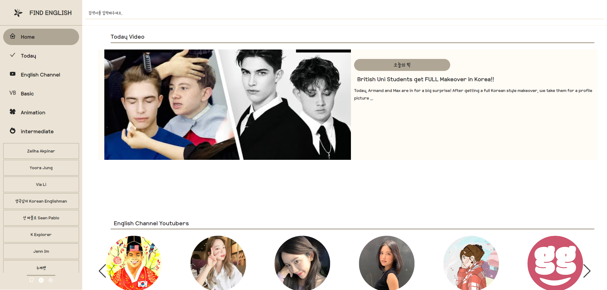
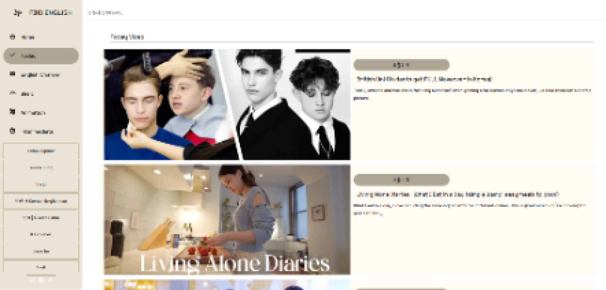
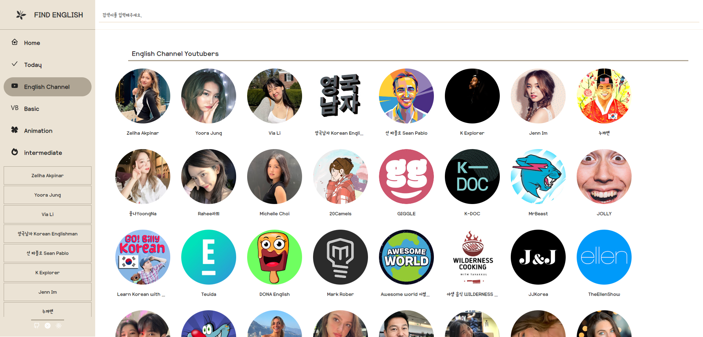
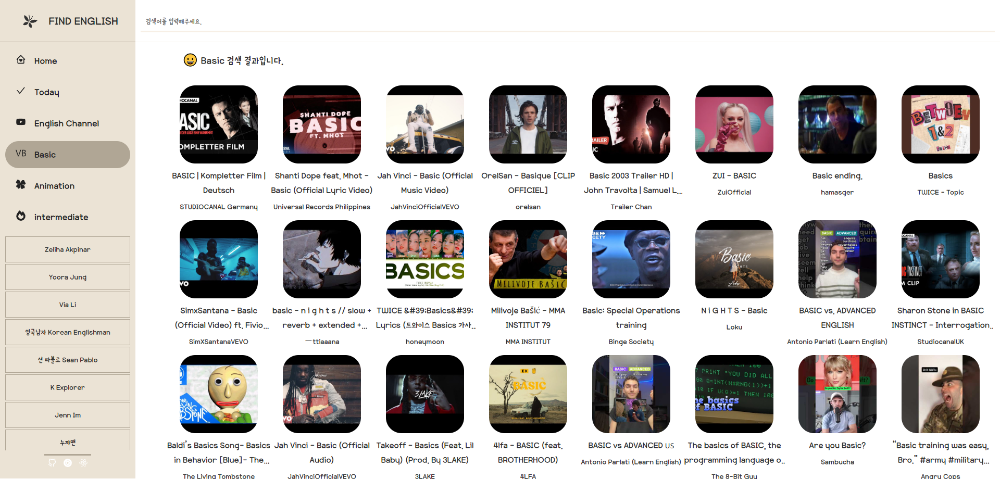
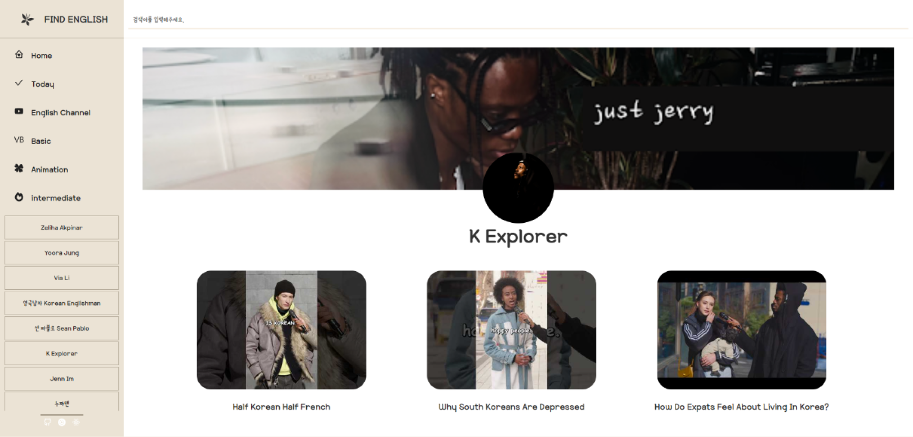
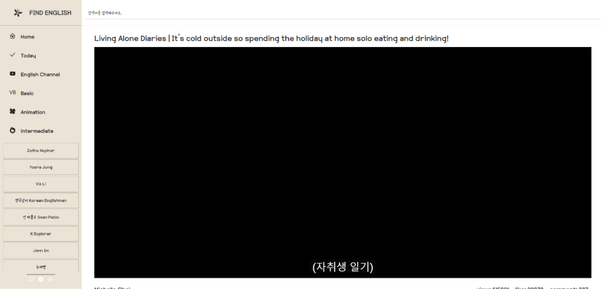

# 나만의 영어 콘텐츠 유튜브 만들기

## 사이트 바로가기: 현재 배포문제 오류 존재

## 개요
영어 콘텐츠를 소개하고, 자주 보는 vlog형식의 콘텐츠를 모아놓음으로 써 유튜브 검색 시간을 줄이고자 제작된 웹 서비스 입니다.
2n년간 영어에 관심은 많지만 늘지 않는 나를 위한 맞춤형 영어 추천 영상을 보여드립니다.
시험을 보지않더라도 영어와 친숙해지기 위해 영어 콘텐츠를 되도록이면 많이 보려고 하지만 현지인들의 억양과 속도는 못따라가는 것이 현실입니다.
애니메이션, 예능 프로그램 혹은 쉬운 단어가 나오는 드라마, 영화를 보는 것이 좋은 방법이지만 영상이 길어지다보니 심심할 때 보기에는 적합하지 않은 감이 있죠.
그래서 유튜브로 영어에 대한 귀가 트이고 맥락을 유추할 수 있는 훈련을 하기 좋은 방법은 한국계 미국인 혹은 한글이 모국어인 사람의 영어콘텐츠가 적합하다 생각했고, 여러가지 콘텐츠가 많은 영어 채널과 한글 자막이 함께 있는 영상들을 모아놓아보자고 결심했습니다.


## 기능
1. 채널 추천
2. 검색
3. 채널가기
4. 영상보기

## Library
1. react-router-dom 
2. axios
3. react-icons
4.  react-player
5.  sass
6.  react-helmet-async
7.  swiper

## 페이지 구성
1. Home ( Today 컴포넌트, Youtuber 컴포넌트, VideoSlider 컴포넌트)


```
const Home = () => {
    const [channelVideo1, setChannelVideo1] = useState([]);
    const [channelVideo2, setChannelVideo2] = useState([]);
    const [channelVideo3, setChannelVideo3] = useState([]);
    const [channelVideo4, setChannelVideo4] = useState([]);

    useEffect(() => {
        const v1 = "UC91ipvI9CR1_s1KATHvzATw";
        const v2 = "UCOgGAfSUy5LvEyVS_LF5kdw";
        const v3 = "UCiTCEqdWFfDy_0BnGttBmDQ";
        const v4 = "UCqJODva8CJ_JTbi5ssC2L-g";

        const fetchResults = async () => {
            try {
                const videosData1 = await fetchFromAPI(`search?channelId=${v1}&part=snippet&order=date`)
                const videosData2 = await fetchFromAPI(`search?channelId=${v2}&part=snippet&order=date`)
                const videosData3 = await fetchFromAPI(`search?channelId=${v3}&part=snippet&order=date`)
                const videosData4 = await fetchFromAPI(`search?channelId=${v4}&part=snippet&order=date`)
                setChannelVideo1(videosData1.items);
                setChannelVideo2(videosData2.items);
                setChannelVideo3(videosData3.items);
                setChannelVideo4(videosData4.items);
                // console.log(videosData1.items);
            } catch (error) {
                console.error('Error fetching video data:', error)
            }
        }
        fetchResults();
    }, [])

    return (
        <Main
            title="English Youtube"
            description="영어 유튜버 모음 사이트에 오신것을 환영합니다."
        >
            <Today />
            <Youtuber />


            <VideoSlider videos={channelVideo1} name1='v1' name2='Yoora Jung' />
            <VideoSlider videos={channelVideo2} name1='v2' name2='영국남자 Korean Englishman' />
            <VideoSlider videos={channelVideo3} name1='v3' name2='융나YoongNa' />
            <VideoSlider videos={channelVideo4} name1='v4' name2='Michelle Choi' />
        </Main >
    )
```


3. Today (데이터가 많아 화질 나쁨 주의)

```
const Today = () => {
    const [todayvideos, settodayvideos] = useState(null);

    // 비디오 가져오기
    useEffect(() => {
        const fetchVideos = async () => {
            try {
                const videos = await fetchFromAPI(`search?type=video&part=snippet&q=english channel korean`)
                settodayvideos(videos.items[0]);
                console.log(todayvideos);
            } catch (error) {
                console.error('Error fetching videos:', error);
            }
        };
        fetchVideos();
    }, []);

    if (!todayvideos) {
        // 데이터가 아직 로딩 중이면 로딩 상태를 표시하거나 아무것도 표시하지 않음
        return <p>Loading...</p>;
    }

    return (
        <section id='today' className='bgcyellow'>
            <h2>Today Video</h2>
            <div className="today__inner">
                <div className="today__thumb">
                    <Link to={`/video/${todayvideos.id.videoId}`} style={{ backgroundImage: `url(${todayvideos.snippet.thumbnails.high.url})` }}></Link>
                </div>

                <div className='today__text'>
                    <span className='today'>오늘의 픽</span>

                    <h3 className='title'>{todayvideos.snippet.title}</h3>
                    <p className='desc'>
                        {todayvideos.snippet.description}
                    </p>
                    <div className="info">
                        <span className='author'></span>
                        <span className='data'></span>
                    </div>
                </div>
            </div>
        </section>
    )
}
```
`YoutubeAP`I를 이용해 `english channel korean`를 키워드로 비디오를 검색


3. Youtuber

```
const youtuber = () => {
    return (

        <section id='youtuber'>
            <div className='youtuber__inner'>
                <h2>English Channel Youtubers</h2>
                <Swiper
                    slidesPerView={6}
                    spaceBetween={20}
                    centeredSlides={false}
                    autoplay={{
                        delay: 3000,
                        disableOnInteraction: false,
                    }}
                    navigation={true}
                    modules={[Autoplay, Navigation]}
                    className="mySwiper"
                    breakpoints={{
                        400: {
                            slidesPerView: 3,
                            spaceBetween: 20
                        },
                        800: {
                            slidesPerView: 4,
                            spaceBetween: 20
                        },
                        1200: {
                            slidesPerView: 5,
                            spaceBetween: 20
                        },
                        1600: {
                            slidesPerView: 6,
                            spaceBetween: 20
                        },
                    }}
                >
                    {youtuberText.map((youtuber, index) => (
                        <SwiperSlide>
                            <div className="youtuber">
                                <div className='youtuber__img'>
                                    <Link to={`/channel/${youtuber.channelId}`}>
                                        
                                    </Link>
                                </div>
                                <div className="youtuber__info">{youtuber.author}</div>
                            </div>
                        </SwiperSlide>
                    ))}
                </Swiper>
            </div>
        </section >
    )
}
```

### Swiper: https://swiperjs.com/

**Swiper라는 라이브러리를 사용하여 이미지 슬라이더를 생성하는 코드입니다. Swiper는 웹 페이지에서 다양한 형태의 슬라이더를 만들 수 있도록 도와주는 자바스크립트 라이브러리입니다. 코드를 살펴보면 다음과 같은 설정이 있습니다:**

**`slidesPerView={6}`: 슬라이더에서 동시에 보여지는 슬라이드의 개수를 설정합니다. 여기서는 6개의 슬라이드가 보여지도록 설정되었습니다.**

**`spaceBetween={20}`: 슬라이드 사이의 간격을 설정합니다. 여기서는 20px의 간격이 설정되었습니다.**

**`centeredSlides={false}`: 슬라이드가 가운데 정렬되지 않고 왼쪽으로 정렬되도록 설정되었습니다.**

**`autoplay`: 자동 재생 기능을 설정합니다.** 

**`delay` 속성은 슬라이드 간의 전환 딜레이를 설정하며, `disableOnInteraction` 속성은 슬라이더와 상호작용할 때 자동 재생을 비활성화할지 여부를 설정합니다.**

**`navigation={true}`: 이전 및 다음 버튼을 표시하여 슬라이드를 탐색할 수 있도록 설정합니다.**

**`modules={[Autoplay, Navigation]}`: Swiper 라이브러리의 추가 모듈을 설정합니다. 여기서는 Autoplay와 Navigation 모듈을 사용하도록 설정되었습니다.**

**`className="mySwiper"`: 슬라이더에 적용되는 CSS 클래스 이름을 설정합니다. 이를 통해 스타일을 적용하거나 스타일 시트에서 해당 클래스를 선택할 수 있습니다.**

**`breakpoints`: 미디어 쿼리를 사용하여 뷰포트 크기에 따라 슬라이더의 설정을 변경할 수 있도록 설정합니다. 여기서는 400px, 800px, 1200px, 1600px의 뷰포트 크기에 따라 슬라이더의 슬라이드 개수와 간격을 다르게 설정하였습니다.**

5. Search

```
const Search = () => {
    const { searchId } = useParams();
    const [videos, setVideos] = useState([]);
    const [loading, setLoading] = useState(true);
    const [nextPageToken, setNextPageToken] = useState(null);

    useEffect(() => {
        setVideos([]);
        fetchVideos(searchId);
        setLoading(true);
    }, [searchId]);


    const fetchVideos = (query, pageToken = '') => {
        fetchFromAPI(`search?type=video&part=snippet&q=${query}&pageToken=${pageToken}`)

            .then((data) => {

                setNextPageToken(data.nextPageToken);
                setVideos((prevVideos) => [...prevVideos, ...data.items])
                console.log(data)
                setLoading(false);
            })
            .catch((error) => {
                console.log("Error fetching data", error);
                setLoading(false);
            })
    }

    const handleLoadMore = () => {
        if (nextPageToken) {
            fetchVideos(searchId, nextPageToken);
        }
    }

    const channelPageClass = loading ? 'isLoading' : 'isLoaded';


    return (
        <Main
            title="서치하는 공간"
            description="흥미가 생길만한 영상을 골라보아요"
        >
            <section id='searchPage'>
                <h2>😀 <em>{searchId}</em> 검색 결과입니다.</h2>

                <div className={`video__inner ${channelPageClass}`}>
                    <VideoSearch videos={videos} />
                </div>

                <div className="video__more">
                    <button onClick={handleLoadMore}>더 보기</button>
                </div>
            </section>
        </Main >

    )

}
```
`**query`는 검색 키워드를 말하며, `pageToken`은 비디오 page를 뜻합니다.**

**검색한 키워드에 따른 비디오를 차례대로 나열하는 코드 입니다.**

7. Channel

```
const Channel = () => {
    const { channelId } = useParams();                          // 채널 아이디 가져오기
    const [channelDetail, setChannelDetail] = useState();       // 정보보기
    const [channelVideo, setChannelVideo] = useState([]);       // 비디오보기
    const [loading, setLoading] = useState(true);               // 로딩
    const [nextPageToken, setNextPageToken] = useState(null);   // 더보기

    useEffect(() => {
        const fetchResults = async () => {
            try {
                const data = await fetchFromAPI(`channels?part=snippet&id=${channelId}`);
                setChannelDetail(data.items[0]);

                const videoData = await fetchFromAPI(`search?channelId=${channelId}&part=snippet&order=date`);
                setChannelVideo(videoData.items);
                setNextPageToken(videoData.nextPageToken);
            } catch (error) {
                console.log("Eroor -> ", error);
            } finally {
                setLoading(false);
            }
        }
        fetchResults();
    }, [channelId])

    const loadMoreVideos = async () => {
        if (nextPageToken) {
            const videosData = await fetchFromAPI(`search?channelId=${channelId}&part=snippet%2Cid&order=date&pageToken=${nextPageToken}`);
            setChannelVideo(prevVideos => [...prevVideos, ...videosData.items]);
            setNextPageToken(videosData?.nextPageToken);
        }
    }

    const channelPageClass = loading ? 'isLoading' : 'isLoaded';

    return (
        <Main
            title="English Channel"
            description="영어를 접하기 쉬운 채널"
        >
            <section id='channelPage' className={channelPageClass}>
                {channelDetail && (
                    <div className="channel__inner">
                        <div className="channel__header">
                            <div className='backImg' style={{ backgroundImage: channelDetail ? `url(${channelDetail.brandingSettings.image.bannerExternalUrl})` : 'none' }}>
                            </div>
                            <div className='useImg'></div>
                            <div className="nickname">{channelDetail.brandingSettings.channel.title}</div>
                        </div>

                        <div className="channel__info">
                            <div className="channel__video">
                                {channelVideo.map((video, index) => (
                                    <div className="video__inner" key={index}>
                                        <div className="video__thumbnails" style={{ backgroundImage: `url(${video.snippet.thumbnails.high.url})` }} alt={video.snippet.title}></div>
                                        <div className="video__title">
                                            {video.snippet.title}
                                        </div>
                                        {/* <div className="video__desc">
                                        {video.snippet.description}
                                    </div> */}
                                    </div>
                                ))}

                            </div>
                            <div className="channel__more">
                                {nextPageToken && <button onClick={loadMoreVideos}>더 보기</button>}
                            </div>
                        </div>
                    </div>

                )
                }
            </section >
        </Main>
    )
}
```

`data `변수에 채널에 관한 정보, `videoData`에 검색한 비디오에 관한 정보를 넣어놓는다.

9. Video

```
const Video = () => {
    const { videoId } = useParams();
    const [videoDetail, setVideoDetail] = useState(null);
    const [tag, settag] = useState('');

    useEffect(() => {
        fetchFromAPI(`videos?part=snippet, statistics&id=${videoId}`)
            .then((data) => {
                setVideoDetail(data.items[0]);
                console.log("영상데이터:", data.items[0]);
                settag(data.items[0].snippet.tags)
            })
    }, [videoId]);


    return (
        <Main
            title="Video"
            description="비디오를 보아요"
        >
            <section id="videoPage">
                <h2 className='blind'>비디오</h2>
                {videoDetail && (
                    <div className="video__view">
                        <h2 className='video__title'>{videoDetail.snippet.title}</h2>

                        <div className="video__play">
                            <ReactPlayer
                                playing={true}
                                width='100%'
                                height='80vh'
                                // style={{ position: "absolute", top: 0, left: 0 }}
                                url={`https://www.youtube.com/watch?v=${videoId}`} />
                        </div>

                        <div className="video__info">
                            <div className='id'>
                                {videoDetail.snippet.channelTitle}
                            </div>
                            <div className='count'>
                                <span className='view'>view: {videoDetail.statistics.viewCount}</span>
                                <span className='like'>like: {videoDetail.statistics.likeCount}</span>
                                <span className='comment'>comment: {videoDetail.statistics.commentCount}</span>
                            </div>
                        </div>
                        <div className="video__desc">
                            <div className="tag">
                                {tag.map((tag, index) => (
                                    <span key={index}>#{tag}      </span>
                                ))}
                            </div>
                            <div className="description">
                                {videoDetail.snippet.description}
                            </div>

                        </div>
                    </div>
                )}
            </section>
        </Main>
    )
}
```

## Layout (header, Search, Footer)
### header (Logo, Menu, Sns)
1. Logo.jsx
```
const Logo = ({ toggleMenuBar }) => {
    return (
        <>
            <h1 className='header__logo'>
                <Link to='/' onClick={toggleMenuBar}>
                    <em><GiButterfly /></em>
                    <div>Find English</div>
                </Link>
            </h1>
        </>
    )
}
```

2. Menu.jsx
```
const Menu = () => {
    const location = useLocation();
    return (
        <nav className='header__menu'>
            <ul className='menu'>
                {menuText.map((menu, key) => (
                    <li key={key} className={location.pathname === menu.src ? 'active' : ''}>
                        <Link to={menu.src}>
                            {menu.icon} {menu.title}
                        </Link>
                    </li>
                ))}
            </ul>
            <ul className='keyword'>
                {keywordText.map((keyword, key) => (
                    <li key={key} className={decodeURIComponent(location.pathname) === decodeURIComponent(keyword.src) ? 'active' : ''}>
                        <Link to={keyword.src}>
                            {keyword.icon} {keyword.title}
                        </Link>
                    </li>
                ))}
            </ul>
        </nav>
    )
}
```

3. Sns.jsx
```
const Sns = () => {
    return (
        <div className="header__sns">
            <ul>
                {snsText.map((sns, key) => (
                    <li key={key}>
                        <a href={sns.src} target='_blank' rel='nonopener noreferrer'>
                            <span>{sns.icon}</span>
                        </a>
                    </li>
                ))}
            </ul>
        </div>
    )
}
```

### Search
1. Search
```
const Search = () => {
    const [searchKeyword, setSearchKeyword] = useState('');
    const Navigate = useNavigate();

    const handleSearch = () => {
        if (searchKeyword) {
            Navigate(`/search/${searchKeyword}`);
            setSearchKeyword('');
        }
    }

    return (
        <div id='search'>
            <div className="search__inner">
                <label htmlFor="searchInput">검색</label>
                <input type='search'
                    id='searchInput'
                    placeholder='검색어를 입력해주세요.'
                    autoComplete='off'
                    className='search__input'
                    onChange={e => setSearchKeyword(e.target.value)}
                    onKeyDown={e => {
                        if (e.key === "Enter") {
                            handleSearch();
                        }
                    }}
                />
            </div>
        </div>
    )
}
```

### Footer
1. Footer
```
const Footer = () => {
    return (
        <footer id='footer' role='contentinfo'>
            <a href="mailto:97.eugene.s@gmail.com"
                rel="noopener noreferrer">
                97.eugene.s@gmail.com
            </a>
        </footer>
    )
}
```

## install
`npm install 
 react-router-dom axios react-icons react-player sass react-helmet-async swiper`

### `npm start`
### `npm test`
### `npm run build`npm install swiper@latest
### `npm run eject`
### `npm run build` fails to minify

## API
use youtube API

### postman
<p>API 개발 및 테스트를 위한 협업 도구로 널리 사용되는 소프트웨어입니다. API 개발 및 테스트를 위한 협업 도구로 널리 사용되는 소프트웨어입니다.</p>
1. API 요청 및 응답 테스트:
HTTP 메서드(GET, POST, PUT, DELETE 등)를 사용하여 API 요청을 작성하고 보낼 수 있습니다.
요청에 필요한 헤더, 바디, 파라미터 등을 쉽게 관리할 수 있습니다.
서버의 응답을 확인하고 테스트할 수 있습니다.
<br>
2. 환경 및 변수:
여러 환경을 설정하여 각각의 환경에 따라 다른 설정을 사용할 수 있습니다.
변수를 사용하여 동적으로 데이터를 생성하고 재사용할 수 있습니다.
<br>
3.컬렉션:
관련된 API 요청을 그룹화하여 컬렉션으로 저장하고 공유할 수 있습니다.
컬렉션을 사용하여 테스트 시나리오를 작성하고 실행할 수 있습니다.
<br>
4.자동화 및 테스트 스크립트:
JavaScript 기반의 스크립트를 사용하여 테스트를 자동화할 수 있습니다.
테스트 시나리오를 스크립트로 작성하여 반복적인 테스트를 자동화할 수 있습니다.
<br>
5. 문서화:
API 요청 및 응답에 대한 문서를 작성하고 공유할 수 있습니다.
Swagger 및 OpenAPI 형식을 지원하여 API 정의를 문서화할 수 있습니다.
<br>
6.모니터링:
API 엔드포인트를 주기적으로 테스트하고 모니터링할 수 있는 기능을 제공합니다.


## git
echo "# EnglishChannel_with_YOUTUBEAPI" >> README.md
  git init
  git add README.md
  git commit -m "first commit"
  git branch -M main
  git remote add origin https://github.com/SeoEugene/EnglishChannel_with_YOUTUBEAPI.git
  git push -u origin main


`git config --global core.autocrlf true // 시스템 전체에 적용`
`git config core.autocrlf true // 해당 프로젝트에만 적용`          

